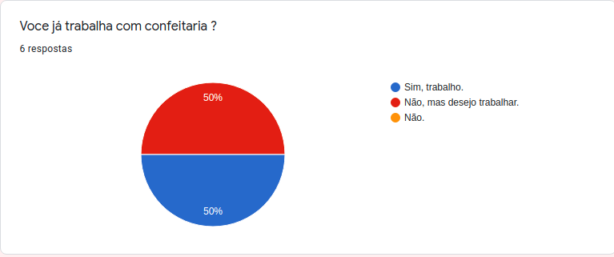
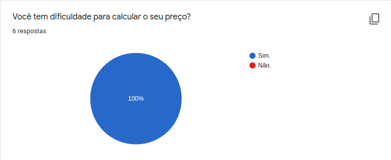
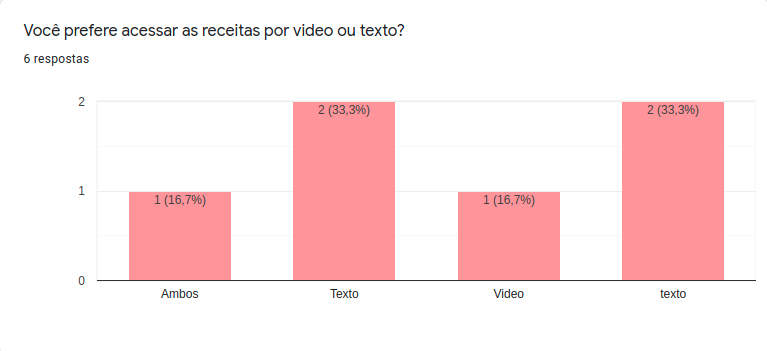
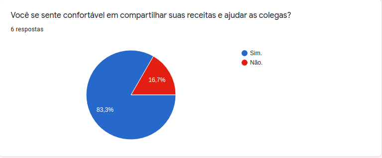
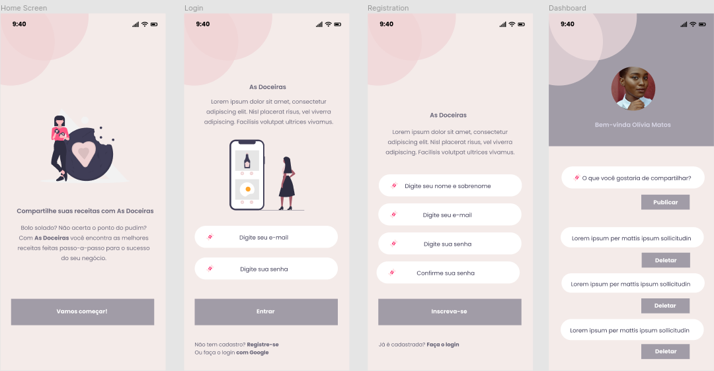

# As Doceiras

## Índice

- [1. Sobre o projeto](#1-sobre-o-projeto)
- [2. Sobre o tema](#2-sobre-o-tema)
- [3. Experiência dos usuários](#3-experiência-dos-usuários)
- [4. Layout](#4-layout)
- [5. Objetivos de Aprendizagem](#5-conteúdo)
- [6. Começando o Projeto](#6-comecando)


## 1. Sobre o projeto

O projeto Social Network, foi criado dentro do bootcamp da Laboratória, com o intuito de nós, alunas da 6ª geração, estudarmos e colocarmos em prática os objetivos de aprendizagem. O tema do projeto era livre e o escolhido foi: "As Doceiras".

Instagram, Snapchat, Twitter, Facebook, Twitch, Linkedin, etc. As redes sociais
invadiram nossas vidas. Nós as amamos ou odiamos, e muitas pessoas não conseguem
viver sem elas.

Há redes sociais de todo tipo para todos os tipos de interesse. Por exemplo: em
uma rodada de financiamento com investidores, foi apresentada uma rede social
para químicos onde os usuários podem publicar artigos a respeito de suas
pesquisas, comentar os artigos de seus colegas e filtrar artigos de acordo com
determinadas tags ou popularidade, mais recente ou mais comentado.

## 2. Sobre o tema

Neste projeto costruímos uma Rede Social sobre o compartilhamento de receitas de doces em geral. A idéia era desenvolver uma página web simples e objetiva, onde o usuário conseguisse postar receitas que realmente funcionam, curtir, editar e deletar um post.

Este projeto foi desenvolvido em dupla, Larissa Maranho e Michele Martins, que além de programadora é doceira. A escolha do tema partiu de uma dificuldade real entre as profissionais, o acesso à receitas que realmente funcionam.

## 3. Experiência dos usuários

Criamos um formulário do Google para entender mais sobre as necissidades dos usuários, questionamos sobre o qual seria o contéudo ideal, se já trabalha no ramo da confeitaria e sobre qual seria a melhor maneira de visualizar as receitas. Além disso, perguntamos sobre as cores da aplicação.


### Você já trabalha com confeitaria?



### Você tem dificuldade para calcular o seu preço?



### Você prefere acessar as receitas por video ou texto?



### Você se sente confortável em compartilhar suas receitas e ajudar as colegas?



### Quais cores você acha que combina com a Rede Social Doceiras?


### Em uma rede social específica para confeiteiras, qual conteúdo você acharia útil?

- _Informações sobre técnicas modernas e ajuda para as dificuldades do dia a dia;_
- _Receitas e técnicas de clássicos da confeitaria;_
- _Espaço para compartilhar receitas e fotos;_
- _Receitas faceis e dicas;_
- _Ter acesso as receitas que fucionam;_
- _Acesso as receitas e compartilhamento._

## Em seguida definimos nossas **Histórias de Usuários:**


### 4. Layout
Escolhemos uma paleta de cores que remetesse à confeitaria e que fosse agradável para o usúario também.

### Paleta de cores:


## Protótipos:

Os protótipos em alta fidelidade foram desenvolvidos no figma usando a técnica Mobile First.



## 5. Objetivos de aprendizagem
- [x] HTML semântico
- [x] CSS flexbox
- [x] Manipulação do DOM
- [x] History API
- [x] localStorage
- [x] Uso de callbacks
- [x] Consumo de Promises
- [x] Uso de ES modules (import | export)
- [x] Firestore
- [x] Firebase Auth
- [x] Firebase security rules
- [x] Uso de onSnapshot | onAuthStateChanged
- [x] Colaboração pelo Github
- [ ] Organização pelo Github
- [x] Modularização
- [x] Nomenclatura / Semântica
- [x] Linting
- [x] Ser uma SPA.
- [x] Ser responsivo.
- [x] Mobile First
- [ ] Teste unitários
- [ ] Testes assíncronos
- [ ] Mocking

## 6. Começando o projeto
Antes de tudo, precisa verificar se o CMDER, NODE e GIT estão instalados em seu computador.
Para instalar e executar a aplicação:
- Faça o fork do repositório no GitHub para salvar os arquivos;
- Utilize um editor de texto como Atom ou Visual Studio Code;
- Configure o GIT pelo terminal com o nome e e-mail;
- Coloque no terminal `npm install` para instalar as dependências;
- Coloque no terminal `npm start` para gerar um localhost.
- Depois de instalar o repositório e suas dependências em seu computador, crie uma nova **Branch** com cada função que irá trabalhar utilizando:
```
git switch -b nomeDaBranch
(cria e entra direto na branch)
```
- Sempre que atualizar um arquivo faça um **Commit** para o GitHub:
```
1. git add nomeDaPasta/nomeDoArquivo.extensão 
**OU** git add . (para adicionar todo o conteúdo)
2. git commit -m "nome da atualização"
3. git push origin nomeDaBranch
```

- Para executar os testes de ESLINT, digite no terminal:
```
npm run pretest
```

- Para executar testes de unidade, digite no terminal: 
```
npm run test
```
- Quando terminar o projeto, faça um **Deploy** no próprio terminal utilizando:
```
npm run deploy.
```

#### 6.1 Inicialização de um projeto no Console do Firebase

Inicie um novo projeto no Firebase:
- Adicionar projeto
- Insira o nome do seu projeto e clique em `Continuar`
- Clicar em `Criar projeto`

Adicionar as colaboradoras ao projeto Firebase

- No Dashboard do projeto criado, há no menu lateral uma engrenagem em `Visão geral do projeto`, selecionar `Usuários e permissões` para adicionar suas colegas como membro no projeto

Adicionar o Firebase ao seu aplicativo

- Adicione um Web app para começar
- Registre o `Apelido do app`
- Selecione para `Também configure o Firebase Hosting para este app`
- `Registrar app`
- `Adicionar o SDK do Firebase` no o arquivo `src/index.html` do projeto

#### 6.2 Instalação global de Firebase em sua máquina

Este projeto está configurado para rodar por meio do servidor do Firebase. Para isso, será necessário possuir o [Firebase CLI](https://firebase.google.com/docs/cli#install_the_firebase_cli) instalado globalmente em sua máquina. Utilize o comando a seguir no seu terminal:

```bash
npm install -g firebase-tools
```

Verifique se foi instalado corretamente, realizando o [login](https://firebase.google.com/docs/cli#sign-in-test-cli):

```bash
firebase login
```

O login é feito por meio de uma conta Google, portanto, deve abrir uma janela em um navegador automaticamente para realizar o login. Se não abrir, pode clicar no link que vai aparecer no terminal.

#### 8.3 Configuração do projeto Firebase no repositório

**IMPORTANTE** rodar todos comandos do Firebase a seguir no terminal a partir da pasta raiz do projeto.

- Executar o comando para realizar o [login](https://firebase.google.com/docs/cli#sign-in-test-cli)
  ```bash
  firebase login
  ```
- Executar o comando para iniciar o setup do projeto
  ```bash
  firebase init
  ```
- Selecionar _Hosting_ (aperte `Espaço` do teclado para selecionar essa opção e depois `Enter`)
- Selecionar `Use an existing project`. No terminal vai aparecer o nome do projeto que você acabou de criar no site do Firebase Console, selecionar e dar `Enter`
- Escrever `src` para definir como `public directory`
- Escrever `y` para selecionar como SPA (Single Page Application)
- Escrever `N` para não fazer builds e deploys automáticos com GitHub
- O Firebase vai dizer que `src/index.html` já existe e pergunta se quer sobrescrever. Sugerimos dar `N`, para não sobrescrever o `index.html`
- Se der tudo certo, o Firebase vai criar o arquivo `.firebaserc` de configuração na pasta do projeto e estamos prontas pra continuar
- Faça o `commit` com a adição dessa configuração para o repositório do seu grupo. Dessa forma, todas terão acesso às configurações do Firebase

#### 8.4 Rodando a aplicação

Após atualização de seu repositório contendo a configuração inicial do projeto Firebase, você deve abrir o terminal na raiz do projeto para rodar o comando de instalação de dependências:

```bash
npm i
```

E para rodar o projeto, use o comando:

```bash
npm start
```

#### 8.5 Configuração de base de dados Firestore Database

No Firebase, adicionar Firestore Database ao projeto Firebase.

- Clique no menu lateral `Firestore Database` e em `Criar banco de dados`
- Selecionar `Iniciar no modo de produção`, clicar em `Avançar`
- Escolher a região `us-east1` e clicar em `Ativar`
- Na tela de `Cloud Firestore`, ir na aba de `Regras` e editar para `true` e `Publicar`
  ```
  rules_version = ‘2’;
  service cloud.firestore {
    match /databases/{database}/documents {
      match /{document=**} {
        allow read, write: if true;
      }
    }
  }
  ```
